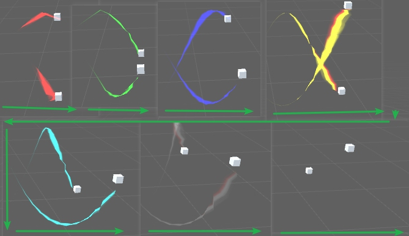

# 拖尾动画

### **结论**：
定义一下： 
+ max中导出fbx骨骼动画 = fbx动画
+ unity中直接给物体key基本变换动画= unity动画  
##### + 拖尾在挂接到fbx动画 unity动画都行情况下，优先使用 unity动画
##### + 必须挂

接到fbx动画:
+ **必须挂接到骨骼上**
+ **要求修改拖尾动画播放帧速率=fbx动画帧速率 **
##### +针对fbx动画拖尾逻辑对不上问题，可以增加拖尾动画帧利用解决

### 说明
1.  问题：实际测试中，拖尾挂接到max导出的fbx 运动轨迹，制作拖尾的透明动画， 总是对不上逻辑，出现一会儿透明一会不透明的现象，但是如果该逻辑在unity中制作，逻辑正确。
2.  原因： 通过测试研究 ，max中fbx 导出动画帧速率通常是30. 而unity 默认帧速率是60 ，导致问题出现。 
3.  解决方法：
      +  首先： 如果制作简单骨骼动画(比如 飞出一个箭) 还是建议在unity中直接给模型key帧，挂接拖尾，给拖尾key透明。
      +  其次： 如果拖尾一定要挂接到骨骼动画上，
           1.  拖尾播放帧速率修改和 骨骼动画一样
           2.  通常在动画停止时候，拖尾动画此时会进行下一个循环播放，逻辑错误，解决方法是，在骨骼动画播放完后在给拖尾key一些帧， 具体长多少，要看效果来决定。

### 实例说明
1. unity中key物体动画+拖尾实例 
   + 动画说明： 螺线轨迹动画时间是58帧。key了染色动画+透明动画，依次播放 红 绿蓝黄青 白 播放到   青 开始透明 到 白 完成全透明。  
    
    
   + 动画列表
     +  动画列表 物体变换 时间和拖尾时间一致  
    
   +  逻辑验证ok(在青开始透明) 
    
      + 简单骨骼动画推荐转用key模型方式，由于物体变换+特效都在一个控制器中，方便预览

2. unity中播放fbx动画+拖尾实例 
   +  动画说明： 螺线轨迹动画时间是58帧。key了染色动画+透明动画，依次播放 红 绿蓝黄青 白 播放到   青 开始透明 到 白 完成全透明。
    
    

   + fbx动画和直接unitykey帧不同
     
      + 1.fbx动画，导入unity不能修改，拖尾动画不能和fbx动画共用一个动画控制器
      + 2.在特效最顶层加入动画控制器，控制拖尾 染色+ 透明逻辑。

    + 动画列表
        + 要求帧速率修改成 30 ，同步fbx动画。
        +  同样表达从青开始透明到白全透明，透明帧要长一些，具体看效果。
        +  最后多余帧要求a通道完全是0，防止在拖尾回收过程中产生的新的轨迹会显示出来。
       
       
    +  逻辑验证ok(在青开始透明) 
    